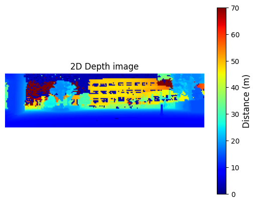
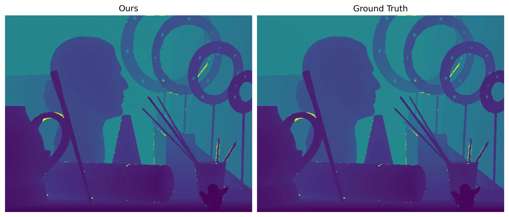

---

# A Paradigm Shift in High-Resolution Depth Estimation Using SPAD-Based LiDAR Histograms: From Signal Filtering to Lightweight Similarity Learning

This document provides a guide for running **LiToFNet** in a Docker environment.

---

## 1. Prerequisites

Ensure that your environment meets the following requirements before running LiToFNet.
If your environment is not yet configured, follow the steps below first.

* A single Linux-based machine (Ubuntu 22.04 LTS or later)
* At least one NVIDIA GPU with CUDA support
* Docker installed and properly configured

---

## 2. Code Execution Locations

Code blocks in this manual follow the format below:

```
[LOCATION]$ command
```

Here, `LOCATION` indicates where the command should be executed:

* **HOST** – Commands run on the host machine
* **CONTAINER** – Commands run inside the Docker container

Make sure you are in the correct environment before running each command.

---

## 3. Installation

1. **Download the anonymized code package** provided for review.

2. **Pull the Docker image:**

   ```
   [HOST]$ docker pull pytorch/pytorch:2.1.0-cuda11.8-cudnn8-runtime
   ```

3. **Run the Docker container:**

   ```
   [HOST]$ docker run --gpus all -dit --name litofnet -v PATH_TO_DIR:/litofnet pytorch/pytorch:2.1.0-cuda11.8-cudnn8-runtime
   ```

   Replace `PATH_TO_DIR` with the absolute path to the root directory of the LiToFNet repository obtained in Step 1.

4. **Enter the Docker container:**

   ```
   [HOST]$ docker exec -it litofnet /bin/bash
   ```

5. **Install the required Python packages:**

   ```
   [CONTAINER]$ pip3 install -r /litofnet/requirements.txt
   ```

---

## 4. Generate Datasets

### (1) Generate Histograms from Middlebury Images

The `data/Middlebury_generation` directory contains:

* `middlebury_histogram_generator`
* `config.json`
* `config_description.txt`

#### Executable: `middlebury_histogram_generator`

* Extracts **depth** and **albedo** values from each pixel of Middlebury raw images
  and generates histograms based on defined simulation parameters.
* The **intensity** and **noise** values are computed following *Lindell et al., 2018*:

* Run the command inside the `data/Middlebury_generation` directory because it requires `config.json`.
  ```
  ./middlebury_histogram_generator
  ```

#### Configuration: `config.json`

* Defines parameters applied when running `middlebury_histogram_generator`
* Detailed descriptions are in `config_description.txt`
* The raw pulse shape could not be provided due to company confidentiality. Instead, setting "pulse_shape": "default" in config.json enables histogram generation using a raw pulse shape.
  Setting `"pulse_shape": "default"` uses the raw pulse shape for histogram generation.

* An additional feature allows the use of a custom pulse shape by setting "pulse_shape": "external" and specifying the file path in "pulse_shape_path".

* A sample file, pulse_example.csv, is provided to illustrate the required format for defining a pulse shape.
This example corresponds to a pulse with a length of 380.
---

### (2) Generate Histograms for Training and Validation

The `data/traindata_generation` directory contains:

* `custom_histogram_generator`
* `custom_config.json`
* `custom_config_description.txt`
* Sample files: `intensity_example.npy`, `noise_example.txt`, and `tof_example.csv`

#### Executable: `custom_histogram_generator`

* Generates histograms under various **noise** and **intensity** conditions
  for training and validation.
* Users can generate histograms randomly or from a predefined `tof_file`.
* Intensity and noise can either be random or read from provided files.
* The provided sample files demonstrate the required formats for predefined inputs.

* Run the command inside the `data/traindata_generation` directory because it requires `custom_config.json`.
  ```
  ./custom_histogram_generator
  ```

#### Configuration: `custom_config.json`

* Contains all adjustable parameters for histogram generation.
* Descriptions are provided in `custom_config_description.txt`.
* Pulse shape handling is identical to that of `middlebury_histogram_generator`.

---

## 5. Run LiToFNet with Real-World Data

### (1) Input Files

The `data/` directory contains sample input files for `run_real.py`.

#### Fine Histogram (`data/fine_histogram.csv`)

* Contains fine ToF histograms and coarse ToF (CTOF) values from the LiDAR sensor.
* Each row corresponds to one pixel; with a 56×200 sensor, there are 11,200 rows.
* Columns 1–64: fine ToF histogram (each bin = 0.416 ps)
* Column `CTOF`: coarse ToF bins
* Total ToF = predicted fine ToF (FToF) + `CTOF × 13.33 ns`

Example:

```
pixel_number	0	1	2	...	61	62	63	CTOF
#1            	0	0	0	...	0	0	0	2
#2            	0	0	0	...	0	0	0	2
...
```

#### Subnetwork 1 Output (`data/subnetwork1_output.csv`)

* Contains the flattened output from Subnetwork 1.
* Each line corresponds to one node in the flatten layer.

Example:

```
-9.48778
10.30811
-7.41797
...
```

### (2) Run Command

```
[CONTAINER]$ python3 /litofnet/scripts/run_real.py
```

### (3) Output Files

#### ToF Data (`output/tof_data.csv`)

* Contains model-estimated ToF values (ns) for each pixel.
* The LiDAR sensor captures a 56×200 image, but only 52×192 are valid.
* Outer rows/columns are dummy and should be removed.

#### 2D Depth Image (`output/2d_depth_image.png`)

* Visualizes ToF × 0.15 (to convert to meters).
* Color bar indicates depth: **lighter colors = farther distance**,
  blue regions = no object detected (0 m).

Generated image:


Reference:


---

## 6. Run LiToFNet with the Middlebury Dataset

### (1) Input Files

`data/Middlebury` contains input files for `run_middlebury.py`.

#### Fine Histogram (`data/Middlebury/histogram/Art/1000_50/`)

* Generated by `middlebury_histogram_generator`.
* To test with different simulation parameters or scenes, 
rerun the generator and update both "simulation_params" and "scenes" in run_middlebury.py.

**Column Descriptions**

| Column   | Description                        |
| -------- | ---------------------------------- |
| bins     | Fine ToF histogram (64 bins)       |
| CTOF     | Coarse ToF (ns)                    |
| FTOF     | Fine ToF (ns)                      |
| TOF      | Total ToF = FTOF + CTOF            |
| NL       | Noise level (photons/μs)           |
| INT      | Intensity                          |
| DISTANCE | Ground-truth pixel depth (m)       |

Example:

```
index  bins                             v_idx  h_idx  CTOF  FTOF      TOF       NL       INT        DISTANCE
0      [0,0,1,0,...]                    0      0      0.0   14.2476   14.2476   92.13    1084.28    2.1371
1      [0,0,1,1,...]                    0      1      0.0   14.2986   14.2986   95.14    1127.77    2.1448
...
```

#### Subnetwork 1 Output

Identical format and usage as in the real-world case.

### (2) Run Command

```
[CONTAINER]$ python3 /litofnet/scripts/run_middlebury.py
```

### (3) Output Files

#### ToF Data (`output/Middlebury_benchmark`)

* Contains `.npy` files storing per-pixel predicted ToF values.
* Each file matches the size of its Middlebury image
  (e.g., Art: 555×695 array).

#### 2D Depth Comparison Images (`output/Middlebury_benchmark/image`)

* `.png` files comparing model-predicted ToF (×0.15) vs. Ground Truth.
* Color bar represents depth: **darker colors = closer objects**.
* Example:

---
## 7. Train LiToFNet

To train LiToFNet, a pulse shape is required.
The original pulse shape cannot be provided due to company confidentiality.
Therefore, to perform training, you need to define your own pulse shape and assign it to the variable `pulse_shape_one`.

### (1) Input Files

The `data/train_sample/` and `data/valid_sample/` directories contain sample input files used for running the training script (`train.py`).

* Dataset(`data/train_sample/train_sample_data_frame_0000.parquet` and `data/valid_sample/valid_sample_data_frame_0000.parquet`)

  * These files were generated using `custom_histogram_generator`.

  * If you want to use a different dataset, generate it using `custom_histogram_generator`, then specify the corresponding file paths in the `"train_data_path"` and `"valid_data_path"` parameters inside `train.py`.

  * The following is an example of `train_sample_data_frame_0000.parquet`:

    ```
    index   bins                                   v_idx   h_idx   CTOF        FTOF      TOF         NL         INT       DISTANCE
    0       [0, 0, 0, 1, 0, 0, 0, 1, 0, 0, ...]    0       1       280.000000  7.305488  287.305481  22.197399  4.633579	43.095825
    1       [0, 0, 0, 0, 0, 0, 0, 0, 0, 0, ...]    0       2       240.000000  4.121893	 244.121887	 3.590614   5.112952	36.618286
    2       [0, 0, 0, 0, 0, 0, 0, 0, 0, 0, ...]	   0       3       680.000000  11.703447 691.703430	 4.319517   0.537776	103.755516
    3       [1, 0, 0, 0, 0, 0, 0, 0, 0, 0, ...]	   0       4       226.666656  11.547069 238.213730	 87.008667	1.760796	35.732059
    ...
    ```

### (2) Run Command

Run the following command inside the Docker container to start training:

```
[CONTAINER]$ python3 /litofnet/scripts/train.py
```

### (3) Output Files

In the `./check_point` directory, the model’s state is automatically saved whenever the training loss improves.
The most recently saved checkpoint corresponds to the best-trained version of the model.

---

## 8. FPGA bitstream

The file `litofnet_bitstream.bit` is a bitstream generated based on `weights/litofnet_weights.pth.`
The FPGA used for implementation is the Kintex XEM7360-K160 from Opal Kelly.

